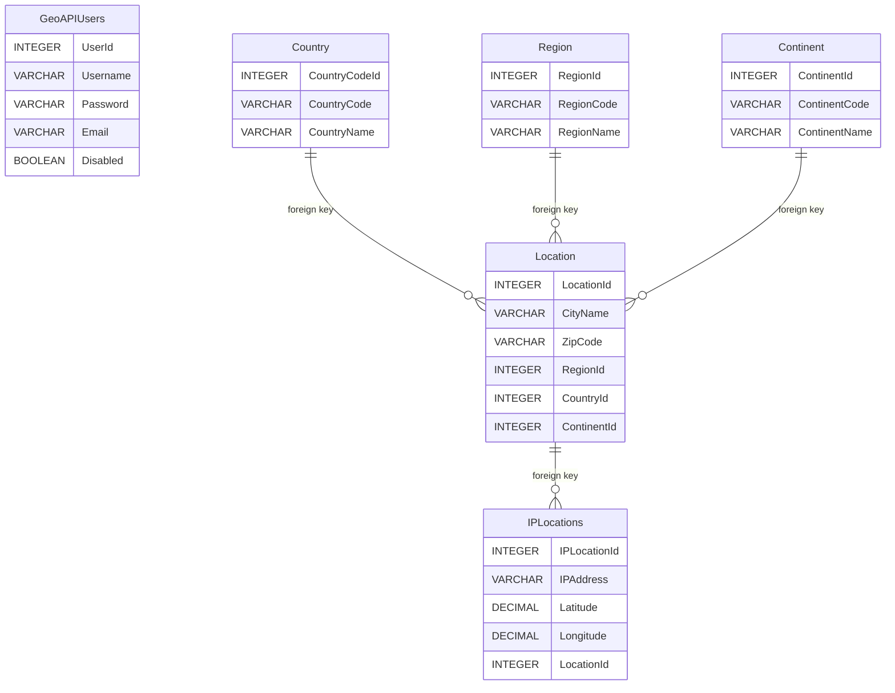

# GeoIP API

## Introduction
This API adds, deletes and provides the geolocation of a given ip or url.
It will use a JWT authentication system to manage those locations to database.

## Installation

### Environment Requirements
The following environment variables need to be set for the API to work:
```
SECRET_KEY=my_secret_key
API_IPSTACK_KEY=my_api_ipstak_key
MYSQL_HOST=localhost
MYSQL_PORT=3306
MYSQL_DATABASE_NAME=geoip_api
MYSQL_USER=geoip_api_root
MYSQL_PASSWORD=my_secret_password
ACCESS_TOKEN_EXPIRE_MINUTES=30
ALGORITHM=HS256
```
### Poetry Installation
Use the following commands:
```
poetry install
poetry shell
uvicorn main:app
```
If want to use the reload option:
```
uvicorn main:app --reload --reload-dir geoip_api
```

### Requirements File Installation
Use the following commands:
```
python -m pip install -r requirements.txt
uvicorn main:app
```

### Installation Via Docker File
If you want to create a docker container please use the following commands:
```CMD
docker build ^
--build-arg SECRET_KEY=my_secret_key ^
--build-arg API_IPSTACK_KEY=my_api_ipstak_key ^
--build-arg MYSQL_HOST=localhost ^
--build-arg MYSQL_PORT=3306 ^
--build-arg MYSQL_DATABASE_NAME=geoip_api ^
--build-arg MYSQL_USER=geoip_api_root ^
--build-arg MYSQL_PASSWORD=my_secret_password ^
--build-arg ACCESS_TOKEN_EXPIRE_MINUTES=30 ^
--build-arg ALGORITHM=HS256 ^
-t geoip_api .

docker run -it --rm --name geoip_api_container -p 8000:8000 geoip_api
```
## Database
The API creates all the tables needed if they are not created. You may check the ER representation below.

### Database Requirements
You must create a MySQL database.
The method of creation can be up to you.
I would recommend using a docker container.

Example:
```cmd
docker run -p 3306:3306 --name geoip_database -e MYSQL_ROOT_PASSWORD=password -d mysql:latest
docker exec -it geoip_database bash
```

It's important that you create the USER and the DATABASE that are going to be used in the API.
You must set that information as environment variables.

For example:

Login to MySQL
```
mysql -uroot -p
```
Execute the following sql statements (some are just for confirmation):
```sql
create database geoip_api;
show databases;
create user 'geoip_api_root'@'%' identified by 'password';
grant all privileges on geoip_api.* to 'geoip_api_root'@'%';
show grants for geoip_api_root;
```

If want to restrict the IP of your API to MySQL connection:
```sql
create user 'geoip_api_root'@'172.17.0.2' identified by 'password';
grant all privileges on geoip_api.* to 'geoip_api_root'@'172.17.0.2';
```
### Entity Relationship Diagram


## Testing

The API has testing files implemented. It's based on Robot Framework.

Using SeleniumLibrary, RequestsLibrary and, JSONLibrary libraries.

You must configure the test variables for them to work.

Example:
```robot
*** Variables ***
${API_URL}   http://localhost:8000/
${username}  username
${email}  email
${password}  password
${IP_TO_TEST}  172.253.62.94
```

To run robot execute the following command (the API must be up for robot to work):
```cmd
robot -d test test\geoapi_api.robot
```

Robot will execute the following test case scenarios:
- Request Register test case:
Target API URL: http://localhost:8000/auth/register
Perform Post request
Expected status code: 201 or 409

- Request Login test case:
Target API URL: http://localhost:8000/auth/login
Perform Post request
Expected status code: 200
Set Token as global variable

- Request Get IP Location test case:
Target API URL: http://localhost:8000/auth/location/ip_url/{ip_url}
Perform Get request using a jwt token
Expected status code: 200

- Request Add IP Location test case:
Target API URL: http://localhost:8000/auth/location/ip_url/{ip_url}
Perform Put request using a jwt token
Expected status code: 201

- Request Delete IP Location test case:
Target API URL: http://localhost:8000/auth/location/ip_url/{ip_url}
Perform Delete request using a jwt token
Expected status code: 200
